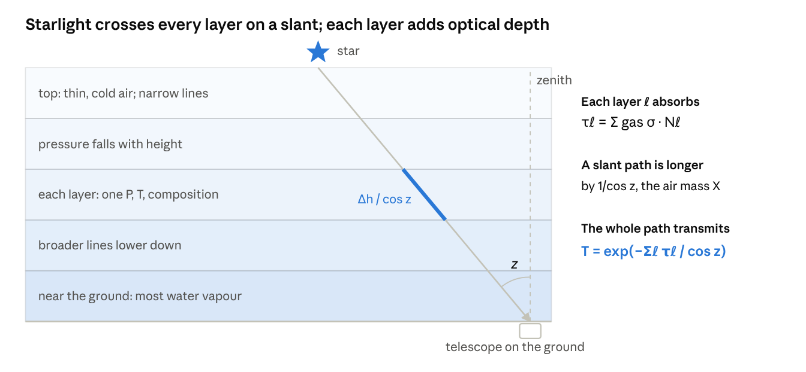
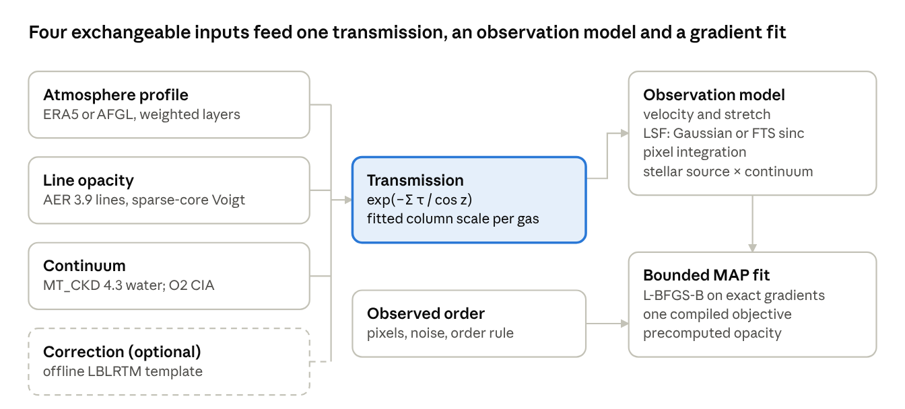
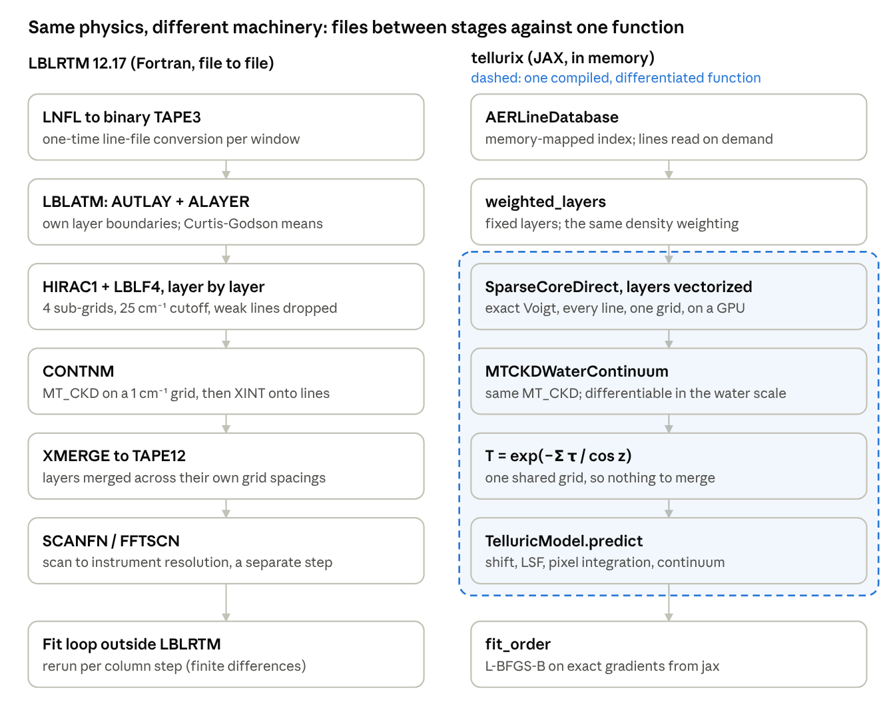
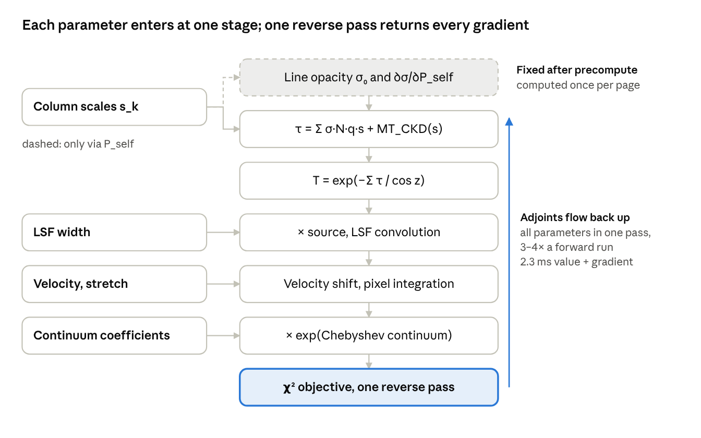

::: {.callout-note}
This page is generated from the working draft; numbers and figures may change before submission.
:::

## Abstract

We present tellurix, a differentiable forward model of terrestrial atmospheric absorption for high-resolution spectra, built on JAX and ExoJAX. It combines line-by-line Voigt opacity from the AER line file, the MT\_CKD 4.3 water continuum, a layered atmosphere from ERA5 or standard profiles, and an instrument model with a Gaussian or FTS line-spread function. A bounded maximum a posteriori fitter uses exact gradients. Evaluating only line–sample pairs that can reach the Voigt core, linearizing the opacity in the one fitted quantity that enters it, and compiling once per spectral order make a staged fit 18× faster, taking 3.3 s on one GPU. Given identical atmospheric layers, the fitted transmission agrees with LBLRTM 12.17 to 0.010% median and 0.039% at the 99th percentile at R = 45,000, once first-order CO2 line coupling is included. We correct the full Arcturus infrared atlas (598 page-epochs, 0.91–5.4 µm) and NSO Kitt Peak solar atlases, measuring each spectrum's instrumental profile from its own interferogram envelope. In both, the residual floor of about 1% comes from the stellar model, not the telluric one. On IGRINS A0V standards from three sites, H and K orders fit to about 1.3σ on a dry night. A night calibration then corrects held-out stars to 0.3–0.5× noise in absorbing orders with one water scale and one velocity per frame. A per-night systematic in the dry-gas columns is traced to header air masses describing only the first exposure of a sequence. The code and all fitted products are public.

## 1. Introduction

The introduction argues one point: telluric correction needs a forward model that is accurate, differentiable and fast enough to fit every order of every frame. Today no single code is all three. Planned paragraphs:

1. **The problem.** Ground-based near-infrared spectra at R \~ 45,000 (IGRINS H and K) carry H2O, CO2, CH4, N2O, CO and O2 absorption at the percent-to-saturated level. Correction by an observed A0V standard transfers its errors: the standard's own lines, an air-mass and time mismatch, and changes in water.
2. **Synthetic correction today.** TelFit (Gullikson et al. 2014) and molecfit (Smette et al. 2015; Kausch et al. 2015) wrap LBLRTM in a derivative-free or finite-difference optimizer. Each fit re-runs LBLRTM, so cost scales with the number of evaluations, and the model cannot share a gradient with a stellar fit.
3. **Differentiable radiative transfer.** ExoJAX (Kawahara et al. 2022, 2025) gives line-by-line opacity in JAX with autodiff on GPUs. It targets exoplanet and brown-dwarf atmospheres, not a layered Earth atmosphere seen along a slant path at an instrument's resolution.
4. **This paper.** tellurix couples ExoJAX opacity to a layered terrestrial atmosphere, the MT\_CKD 4.3 water continuum, AER Line File 3.9, an instrument model and a bounded MAP fitter. LBLRTM 12.17 serves as the regression reference, not the runtime. We validate it against LBLRTM, then apply it to three kinds of data: the Arcturus FTS atlas, the NSO Kitt Peak solar atlases and IGRINS A0V standards from three sites.
5. **Outline** of the remaining sections.

## 2. The forward model

A ground-based spectrum is the star's light multiplied by the transmission of Earth's atmosphere and then blurred and sampled by the spectrograph. To remove the atmosphere we model it: we write down, from physics, the spectrum the instrument *should* record for a given atmosphere, star and instrument. This is called a **forward model**. We then adjust the model's few free parameters, such as the amount of water vapour, until the prediction matches the data. Once it does, dividing the data by the fitted atmospheric transmission leaves the star.

This chapter builds that forward model in the order light meets it:

- **Absorption along the path (2.1).** Light passes through a layered atmosphere and loses intensity by absorption.
- **Molecular lines (2.2).** Most of that absorption happens in narrow lines, each with a strength and a shape.
- **The continuum (2.3).** A smooth component that individual lines miss.
- **The instrument (2.4).** The spectrograph smears and samples the result.
- **Implementation (2.5–2.10).** How tellurix computes all of this quickly enough to fit, and with derivatives, compared step by step with LBLRTM, the reference code of the field.

The symbols used throughout the chapter:

| Symbol | Meaning | Typical unit |
| --- | --- | --- |
| ν | wavenumber, 1/λ; spectroscopists' unit of frequency | cm−1 (5000 cm−1 = 2.0 µm) |
| I, I₀ | intensity after and before absorption | any |
| T(ν) | transmission, I/I₀, between 0 and 1 | — |
| τ(ν) | optical depth, −ln T | — |
| σ(ν) | absorption cross-section per molecule | cm² |
| N | column density: molecules per unit area along the path | cm−2 |
| S | line strength (integrated cross-section of one line) | cm−1/(molecule cm−2) |
| ν₀ | line centre | cm−1 |
| α\_D, α\_L, α\_V | Doppler, Lorentz (pressure) and Voigt half-widths of a line | cm−1 |
| P, T\_k, P\_self | pressure, temperature, partial pressure of the absorbing gas itself | bar or atm, K |
| z | zenith angle: the angle between the line of sight and vertical | degrees |
| X = 1/cos z | air mass: path length relative to looking straight up | — |
| s | fitted column scale of one gas, relative to the model atmosphere | — |
| R = λ/Δλ | resolving power of the spectrograph | 45,000 for IGRINS |

### 2.1 Light through a layered atmosphere

**Absorption along a path.** When light of intensity I crosses a thin slab containing n absorbing molecules per cm³, each with cross-section σ (the effective area it blocks), a fraction σn ds is removed over a length ds: dI = −I σ n ds. Integrating gives the Beer–Lambert law,

$$
I(\nu) = I_0(\nu)\,e^{-\tau(\nu)}, \qquad \tau(\nu) = \int \sigma(\nu)\, n\, ds = \sigma(\nu)\,N
$$

Here τ is the **optical depth** and N = ∫n ds is the **column density**: the number of molecules in a 1 cm² tube along the line of sight. Optical depths of different gases add, so their transmissions multiply. Everything that depends on wavenumber sits in σ(ν), and most of the next section is about computing it.

**Why layers.** The atmosphere is not uniform:

- Pressure falls roughly exponentially with height, by a factor e about every 8 km.
- Temperature changes by tens of kelvin between the ground and the stratosphere.
- Water vapour is concentrated in the lowest few kilometres.

Because σ itself depends on pressure and temperature (Section 2.2), the integral cannot be done with one σ. We therefore cut the atmosphere into layers ℓ, typically 12, each with a single pressure, temperature and composition, and sum their contributions. Choosing those layer values well is a numerical question of its own (Section 2.7).

**Air mass.** A star observed at zenith angle z is seen through a path longer than the vertical one by 1/cos z, called the **air mass** X. Treating the layers as flat (plane-parallel), which is accurate except close to the horizon, the transmission of the whole path is

$$
T(\nu) = \exp\Big[-\frac{1}{\cos z}\sum_{\ell}\Big(\sum_{\rm gas} s_{\rm gas}\,N_{{\rm gas},\ell}\;\sigma_{\rm gas}(\nu;P_\ell,T_\ell,P_{{\rm self},\ell}) + \tau^{\rm cont}_\ell(\nu)\Big)\Big]
$$

{fig-alt="schematic · plane-parallel layered atmosphere, as in TelluricModel.transmission" width=100%}

**Where the atmosphere comes from.** Pressure, temperature and composition at the site and time of an observation come from ERA5, a global weather reanalysis, or from standard AFGL model atmospheres. The water content changes from hour to hour, and well-mixed gases such as CO2 and CH4 drift slowly. Each gas's column is therefore multiplied by a free **column scale** s\_gas, fitted to the data. tellurix keeps the layers top to bottom, with pressure increasing downward (`AtmosphereProfile`, `site_profile.py`, `tellurix.era5`).

### 2.2 Molecular absorption lines

**What a line is.** A molecule can only absorb a photon whose energy matches the difference between two of its quantized energy levels. In the near infrared these are mostly vibration–rotation transitions: a change in how the atoms vibrate, together with a change in how fast the molecule rotates. Each transition absorbs at its own wavenumber ν₀, called a **line**. Molecules have many rotational levels, so every vibrational change produces a **band** of hundreds to thousands of lines. Examples are the water bands at 1.4 and 1.9 µm and the CO2 bands at 1.6 and 2.0 µm (Figure 2.4). The positions, strengths and broadening coefficients of these lines are measured in laboratories and compiled in line lists such as HITRAN. tellurix uses AER Line File 3.9, the list LBLRTM uses.

The cross-section of one line is its integrated strength S times a normalized shape function f:

$$
\sigma(\nu) = S(T)\, f(\nu - \nu_0;\, \alpha_D, \alpha_L), \qquad \int f\, d\nu = 1
$$

The total σ is the sum over every line of the gas.

**Strength depends on temperature.** A line absorbs only from molecules in its lower energy level E″, and how many sit there follows the Boltzmann distribution. Line lists give S at T\_ref = 296 K, and it is scaled to the layer temperature with the partition function Q(T) and the second radiation constant c₂ = hc/k = 1.4388 cm K:

$$
S(T) = S(T_{\rm ref})\,\frac{Q(T_{\rm ref})}{Q(T)}\,\exp\!\Big[-c_2 E''\Big(\frac{1}{T}-\frac{1}{T_{\rm ref}}\Big)\Big]\,\frac{1-e^{-c_2\nu_0/T}}{1-e^{-c_2\nu_0/T_{\rm ref}}}
$$

Lines from high-lying levels weaken quickly in cold layers. That is one reason the vertical temperature profile matters.

**Shape: two broadening mechanisms.**

- **Doppler broadening.** Molecules move thermally along the line of sight, so each sees the light Doppler-shifted. This gives a Gaussian profile of half-width α\_D = (ν₀/c)√(2 ln 2 kT/m). For water at 2 µm, α\_D ≈ 0.007 cm−1.
- **Pressure (collisional) broadening.** Collisions interrupt the molecule while it absorbs. This gives a Lorentzian profile of half-width α\_L = (γ\_air · (P − P\_self) + γ\_self · P\_self) · (T\_ref / T)ⁿ, proportional to pressure. Near the ground α\_L ≈ 0.07 cm−1, ten times the Doppler width. Above about 20 km (57 hPa), Doppler broadening dominates (Figure 2.2).
- **The Voigt profile.** Both act at once, so the true shape is their convolution, the Voigt profile. It has no closed form. It is computed from the complex Faddeeva function w(z): the Voigt profile is proportional to Re w(x + ia), with x the distance from line centre and a the ratio of the Lorentz to Doppler widths, both in units of the Doppler width. Evaluating w accurately and quickly is the computational heart of the problem.

**Wings and why the calculation is expensive.** Far from its centre a Lorentzian falls only as 1/(ν − ν₀)², so a strong line still absorbs measurably tens of cm−1 away. A model of one spectral window must therefore include every line within a 25 cm−1 margin around it. For one IGRINS K order this means about 13,000 lines, 2,800 spectral samples and 12 layers: roughly 4 × 10⁸ evaluations of w for a single model spectrum. Sections 2.6 and 2.10 explain how the two codes make this affordable.

**Two refinements.**

- **Pressure shift.** Collisions also shift each line centre slightly, by δ\_air × P, typically 0.01 cm−1 per atmosphere. Both codes apply it; tellurix makes it optional.
- **Line coupling (line mixing).** When neighbouring lines overlap at high pressure, collisions transfer intensity between them. To first order this adds a small antisymmetric term to each line, proportional to a coupling coefficient Y times pressure (Section 2.8). It matters for the dense CO2 bands at 2.0 and 1.6 µm.

{fig-alt="line shape anatomy" width=100%}

**Figure 2.2. How one water line gets its shape and strength** (H2O at 5004.585 cm−1, AER 3.9, in each layer of an ERA5 atmosphere over Gemini South).

- **(a) Widths against height.** The Doppler width barely changes (0.006–0.007 cm−1), while the pressure width falls with pressure, from 0.065 cm−1 in the lowest layer. The two are equal at 57 hPa, about 20 km: below that, pressure broadening dominates the line; above it, Doppler does. The dotted line marks half of IGRINS's resolution element, so lines from the lowest layers are about as wide as what the spectrograph can resolve.
- **(b) The profile in four layers.** Near the ground the Voigt profile is essentially Lorentzian. In the stratosphere its core is Gaussian, but its far wings are still Lorentzian, falling as 1/(ν − ν₀)², and it is those wings that make far-away lines matter.
- **(c) Temperature.** A line from a low-lying level (E″ = 135 cm−1) strengthens slightly in cold air. One from a high level (E″ = 1813 cm−1) weakens by an order of magnitude over the temperatures of this atmosphere, which is why each layer's temperature enters the calculation.

### 2.3 The continuum

Adding up individual Voigt lines does not reproduce all the absorption measured in the laboratory or in the field. A smooth extra component, varying over hundreds of cm−1, remains. This is the **continuum**. For water it has two parts:

- the **self continuum**, from water molecules colliding with each other, proportional to the square of the water density;
- the **foreign continuum**, from water colliding with N2 and O2, proportional to water density times air density.

Its physical origin is still debated: far line wings that are not exactly Lorentzian, and short-lived water dimers, both contribute. In practice it is modelled semi-empirically. MT\_CKD (Mlawer et al. 2012, 2023) tabulates coefficients fitted to measurements on a 10 cm−1 grid, and both codes use the same version 4.3.

One convention matters for consistency with the lines. MT\_CKD is defined as what remains once every line has been cut at 25 cm−1 from its centre and its value at the cut has been subtracted (the “pedestal”). LBLRTM shapes its lines exactly that way. tellurix keeps the full Voigt wing, so the two descriptions overlap slightly. The overlap is smooth over a spectral order, and the fitted continuum of Section 2.4 absorbs it (Sections 2.6 and 4).

The water continuum is weak inside the IGRINS bands: a mean optical depth of about 0.003 at 2.0 µm on a dry night. It is strongest in the opaque 1.9 µm water band between H and K (Figure 2.7b). Its importance is that it is smooth across an entire order, where a bias would otherwise mimic a wrong column. For the solar spectra tellurix also includes the collision-induced absorption of O2 (O2–O2 and O2–N2 pairs), ported from LBLRTM. It changes the spectrum near 1.27 µm by up to 9%.

### 2.4 From the sky to the detector

The atmosphere's transmission is not what the detector records. Four more steps connect it to the data.

**1. The star.** The light entering the atmosphere is the star's own spectrum F★(ν), with its own absorption lines. Telluric lines stay fixed in the observatory's frame. Stellar lines are Doppler-shifted by the star's radial velocity and by Earth's orbital motion, which changes by up to ±30 km/s over a year. This difference is what lets the two be separated. tellurix multiplies the transmission by a synthetic stellar spectrum from The Payne Zero (an A0V star for IGRINS standards, the Sun or Arcturus for the atlases), shifted by a fitted stellar velocity (`stellar.py`).

**2. Finite resolution.** A spectrograph cannot separate features closer than about Δλ = λ/R, where R is its **resolving power**. Its output is the true spectrum convolved with the **line-spread function** (LSF), the response to an infinitely narrow line. Two kinds of instrument are treated:

- **IGRINS**, a slit-fed echelle spectrograph with R ≈ 45,000, whose LSF is close to a Gaussian 6.7 km/s wide (FWHM).
- **Fourier-transform spectrometers (FTS)**, which made the solar and Arcturus atlases. An FTS measures an interferogram up to a maximum optical path difference L and Fourier-transforms it. Cutting the interferogram at L makes the LSF a sinc function, sin(x)/x, whose width is set by L. That sinc has slowly decaying side lobes, and how they are handled matters (Section 2.9).

Telluric lines at R = 45,000 are only partly resolved: a typical water line, 0.15 cm−1 wide, spans about one resolution element. That is why the model is computed on a grid four times finer than the instrument's resolution and then convolved.

**3. Pixels and wavelengths.** Each detector pixel collects light over a finite wavelength range. The model integrates over each pixel with Simpson's rule rather than sampling its centre (an FTS samples points, so there it is switched off). The pipeline's wavelength solution can be off by a fraction of a pixel, so a velocity shift and a small linear stretch are fitted.

**4. The continuum level.** The echelle's blaze function, the flat field and the star's slope multiply the spectrum by a smooth function. It is modelled as the exponential of a low-order Chebyshev polynomial, with fitted coefficients.

Putting the steps together, the model flux in pixel i is

$$
F_i = \exp\Big(\sum_k c_k\,T_k(x_i)\Big)\;\frac{1}{\Delta\lambda_i}\int_{\rm pixel\ i}\big[(F_\star\cdot T)\otimes{\rm LSF}\big](\lambda)\,d\lambda
$$

Here T\_k are Chebyshev polynomials and x\_i is the pixel position scaled to \[−1, 1\]. The free parameters of a fit are few:

- one column scale per absorbing gas;
- the telluric and stellar velocities and the wavelength stretch;
- the LSF width;
- the continuum coefficients;
- an extra noise term (“jitter”).

**What the model produces.** The figures below are the transmission of one real atmosphere: ERA5 over Gemini South on 2021-03-17, 4.3 mm of precipitable water, air mass 1.5. They come from the full line-by-line calculation at IGRINS sampling: about 1.3 million lines of seven gases, with the water continuum and O2 collision-induced absorption.

{fig-alt="sky transmission 0.9-5.3 um" width=100%}

**Figure 2.4a. The near-infrared sky, 0.9–5.3 µm, smoothed to R = 2,000.** Absorption bands of water, CO2 and CH4 divide the spectrum into the familiar J, H, K, L′ and M′ windows (grey). Even inside the windows the sky is far from transparent. IGRINS covers H and K (blue bars).

{fig-alt="H and K by molecule" width=100%}

**Figure 2.4b. H and K at IGRINS resolution, and who absorbs what.**

- **(b) All gases together, R = 45,000.** H is mostly clear, with mean transmission 0.94 and 13% of samples below 0.9. K is much harder, with mean 0.83 and 41% of samples below 0.9.
- **(c) One gas at a time:**
  - water, with its continuum, closes the gaps between the bands;
  - CO2 saturates at 2.0 µm and absorbs up to 50% at 1.57 and 1.60 µm;
  - CH4 fills the red half of K, with its deepest line 81% deep at 2.3 µm;
  - N2O and CO are weak, at most 6–7% (their rows are magnified);
  - O2 and O3 absorb under 1% anywhere in H and K.
- **(d) A 2 nm zoom at 2.318 µm.** The grey curve is the atmosphere at infinite resolution; the black curve is what the spectrograph records. The deepest line reaches 0.17 but appears only as 0.52 after the line-spread function. Fitting at the instrument's resolution therefore depends on a correct LSF as much as on correct lines.

{fig-alt="F1 draft · model composition, from model.py and fit.py" width=100%}

The whole model at a glance. The four inputs on the left (atmosphere, line opacity, continuum and an optional LBLRTM correction template) are interchangeable components, so tests can run without spectroscopic data. They produce the transmission, which the observation model turns into pixel fluxes (Section 2.4), and a bounded fit adjusts the parameters using exact gradients (Section 2.5).

### 2.5 Implementation, side by side with LBLRTM

Before comparing the two codes, here is what a modern fitting code needs, briefly.

**Fitting needs gradients.** A fit adjusts the parameters θ to minimize χ²(θ) = Σ\_i (data\_i − model\_i)²/σ\_i². The most efficient optimizers use the gradient ∂χ²/∂θ, which says which way is downhill. tellurix uses L-BFGS-B, which also builds up an estimate of the curvature from successive gradients and respects parameter bounds. Each iteration needs χ² and its gradient.

**Two ways to get a gradient.**

- **Finite differences.** Nudge each parameter by a small step h and rerun the model: P + 1 runs for P parameters, or 2P + 1 for the more accurate central difference. The answer depends on h. Too large a step gives truncation error; too small a step loses the difference in rounding error (Figure 2.10d). An LBLRTM-based fit has no other option, because LBLRTM computes only spectra.
- **Automatic differentiation (autodiff).** A program, however long, is a chain of elementary operations (add, multiply, exp, …), each with a known derivative. An autodiff system applies the chain rule through that chain mechanically, giving derivatives exact to rounding error with no step to choose. In **reverse mode** (back-propagation, as used to train neural networks), the gradient of one number such as χ² with respect to *all* parameters costs a single backward pass. That pass costs a few times one model evaluation, whatever the number of parameters.

**JAX, compilation and GPUs.** tellurix is written in JAX, a Python library with a NumPy-like interface:

- `jax.grad` turns a function into one that returns its gradient.
- `jax.jit` traces the function once and compiles it, through the XLA compiler, into fused machine code for a CPU or a GPU. Compilation takes seconds, but each later call takes milliseconds, so a fit should compile once and reuse the result (Section 3).
- `jax.vmap` vectorizes a function, for example over atmospheric layers.

A GPU has thousands of simple arithmetic units. The line-by-line calculation is the same arithmetic repeated over roughly 10⁸ independent line–sample pairs, which suits it ideally. GPUs are fastest in single precision, which motivates the mixed-precision scheme of Section 2.10.

**The price.** Compiled, differentiable code must be written as operations on whole arrays of fixed shape. An `if` statement whose outcome differs from element to element is usually computed both ways, with the unwanted result discarded. Several of tellurix's techniques (Section 2.10) exist to avoid that waste. The Voigt opacity itself comes from ExoJAX (Kawahara et al. 2022), a JAX code for exoplanet atmospheres, and tellurix builds the terrestrial model around it.

tellurix computes the same physics as LBLRTM, stage for stage, but it changes three things about how that physics is executed:

1. It evaluates every line exactly rather than approximating cheaply.
2. It puts all layers on one grid, so there is no merge step.
3. It keeps the whole chain from opacity to detector pixels inside one compiled function that JAX can differentiate.

Sections 2.6–2.10 compare each stage, with LBLRTM routines cited from its 12.17 source.

{fig-alt="pipelines · LBLRTM from lblrtm.f90, oprop.f90, xmerge.f90, postsub.f90; tellurix from model.py, direct.py" width=100%}

LBLRTM passes files between stages: TAPE3, TAPE10 per layer and TAPE12. Its output stops at a scanned spectrum, so a fit has to rerun it. In tellurix, rows 3–6 are one compiled function, and its gradient comes from the same call.

### 2.6 Line-shape evaluation and line rejection

*In plain terms.* Section 2.2 showed that a model spectrum needs the Voigt profile of every line at every spectral sample, about 10⁸ times. Near a line's centre the Faddeeva function needs a careful, comparatively slow algorithm; tellurix uses Algorithm 916 of Zaghloul & Ali (2011). Far from the centre (large x) a short asymptotic series, w(z) ≈ (i/√π)(1/z + 1/(2z³) + 3/(4z⁵) + …), is accurate and cheap. A code can save time in two ways:

1. Evaluate the expensive part only where it is needed. LBLRTM does this by splitting each line into pieces stored on grids of different spacing; tellurix by choosing, pair by pair, which formula to use.
2. Skip lines too weak to matter. LBLRTM does this by default; tellurix does not.

Below, “grid” means the set of wavenumbers at which the spectrum is computed, and DV its spacing.

LBLRTM makes each line cheap by splitting it into four pieces on progressively coarser grids, and by dropping weak lines. tellurix evaluates the exact Voigt at every grid point and keeps every line; the sparse core keeps that affordable (Section 2.10). Both reach the same core, and they differ in the far wing at the 1e−5 level.

|  | LBLRTM 12.17 (`oprop.f90`) | tellurix |
| --- | --- | --- |
| Line profile | Four sub-functions: F1–F3 out to 4, 16 and 64 α\_V on grids DV, 4DV and 16DV (HIRAC1/CNVFNV, 168–1349), and F4 from 64 α\_V to 25 cm−1 on 64DV (LBLF4/CONVF4, 3938–4010), joined by 4-point Lagrange (PANEL) and cubic (XINT) interpolation | Exact Voigt (ExoJAX `hjert`): Algorithm 916 where x² + a² < 111, asymptotic series elsewhere, at every grid point of a constant-velocity grid |
| Lookup | Pre-tabulated shapes, nearest node (1313–1319) | Evaluated directly |
| Cutoff | 25 cm−1, less a pedestal; CO2 uses (2 − x²/B²) L(B) (3956); χ forced to 1 (4075) | None: every line within the 25 cm−1 selection margin, full wing |
| Weak lines | Rejected per layer when S·N/α\_V ≤ DPTMIN + DPTFAC·R4 (2e−4, 1e−3; 1153–1171, 3900–3917); coupled lines exempt | All kept; optional `select_significant_lines` with a guaranteed error bound |
| Grid | Per layer, DV from the mean Voigt width of a nominal line (0.0014–0.0077 cm−1 here) | One grid for all layers (0.028 cm−1 at R = 45,000 × 4) |

{fig-alt="line shape" width=100%}

**Figure 2.6a. One H2O line (5004.585 cm−1, 800 hPa, 280 K) in both codes.** (a) LBLRTM's four sub-functions and their sum, compared with its own output (circles). (b) tellurix's branches: Algorithm 916 within 0.051 cm−1, the core list within 0.147 cm−1, the asymptotic series beyond, with no cutoff. (c) The core, where both sample the same Voigt. (d) Departure from the exact Voigt: LBLRTM reaches 8e−4 of the peak in the core from table lookup, then levels off at the pedestal (8.7e−6 of the peak); tellurix stays below 2.4e−8.

{fig-alt="rejection" width=100%}

**Figure 2.6b. LBLRTM's line rejection, bottom layer of the ERA5 profile, 5000–5020 cm−1.**

- (a) HIRAC1 keeps 372 of the 4207 lines it tests: 90% are rejected.
- (b) The rejected lines carry 0.74% of the layer's line optical depth, as a smooth floor of 2–9e−4.
- (c) Over the 12-layer path, rejection changes the transmission by up to 0.62% at R = 45,000. tellurix's optional selection with a 1e−3 budget changes it by at most 4.6e−6, and its default changes nothing.

The floor is smooth, so a fitted continuum absorbs it, which is why the fitted comparisons in Section 4 agree far better than 0.6%.

### 2.7 Layering and continuum

*In plain terms.* A layer is described by one pressure and one temperature, yet the real air inside it spans a range of both. Which single values best represent the layer? The standard answer, the Curtis–Godson approximation, averages pressure and temperature weighted by the amount of air, and adds up (integrates) each gas's molecules exactly. Done carelessly, for example by taking the values at the layer's mid-point, the water column can be wrong by tens of percent in a single layer, because water falls off steeply with height. The continuum (Section 2.3) is evaluated per layer as well.

Both codes average each layer the same way: density-weighted pressure and temperature, and gas amounts integrated with exponential interpolation between levels. They differ in where they put the boundaries. Given the same levels, they agree on the water column to 0.001%.

| Step | LBLRTM 12.17 | tellurix |
| --- | --- | --- |
| Layer boundaries | AUTLAY (`lblatm.f90:5774`): a new layer when the Voigt-width ratio reaches 1.5 or the temperature range exceeds 5–8 K; rounded to 0.1 km | fixed count (12 by default) from the ERA5 or AFGL levels (`site_profile.py`) |
| Layer means | ALAYER/FPACK (`lblatm.f90:5640–6175`): density-weighted P and T, exponentially interpolated densities | `weighted_layers`: the same weighting, written to the profile's `pressure_bar` column; centre sampling kept for old records |
| H2O continuum | MT\_CKD 4.3 on a 1 cm−1 grid (`lblrtm.f90:6215`), then interpolated onto the line grid by XINT (`oprop.f90:519`) | the same coefficients and formulas in JAX; P–T factors fixed at construction, so the continuum stays differentiable in water: self ∝ c², foreign ∝ c(1 − cx) |

{fig-alt="layering" width=100%}

**Figure 2.7a. One ERA5 column (DCT 2018-12-21) given to both codes as the same 24 levels.** (a, b) Temperature and water, with each scheme's boundaries and layer means: LBLRTM's AUTLAY makes 19 layers, tellurix 12. (c) Each layer's water column against a fine integral of the same atmosphere. LBLRTM and weighted tellurix are both within 0.001% in total; centre sampling is 1.55% high overall and up to 36% off in single layers. (d) The earlier 6-layer comparison case: given 7 levels, LBLRTM's exponential interpolation sags below the layer values by up to 23% in the second layer, which is why its water column came out 12.2% lower.

{fig-alt="continuum" width=100%}

**Figure 2.7b. MT\_CKD 4.3 water continuum, 4000–6500 cm−1, LBLRTM against tellurix on identical layers.** The median relative difference is 0.0013% (self) and 0.0003% (foreign); the 99th percentile is 0.14% and 0.026%, in the weak, noisy wings. LBLRTM was run with the columns scaled ×100 so that its float32 output resolves τ \~ 1e−5. The committed 0.024–0.107% agreement is therefore an upper bound set by that precision. (c) LBLRTM runs at c = 0.5, 1 and 2 follow tellurix's analytic scaling, which is what makes the continuum differentiable in the water scale.

### 2.8 Line coupling

*In plain terms.* Treating each line independently assumes that a collision changes only one transition at a time. When lines crowd together at high pressure, as in a CO2 band, collisions also move intensity from one line to its neighbours. The band's centre then absorbs more than the sum of independent lines, and its edges less. To first order, Rosenkranz (1975) showed that this adds an antisymmetric partner to each line:

$$
\sigma(\nu) \propto S\,\big[\,{\rm Re}\,w(z) + Y p\,{\rm Im}\,w(z)\,\big]
$$

Here Re w is the ordinary Voigt shape, Im w its dispersive companion, which is positive on one side of the line and negative on the other, and Y a coupling coefficient that comes with the line list. The effect is small, about 1% of the CO2 optical depth at 2 µm, but it is systematic across a whole band.

Both codes add AER's first-order (Rosenkranz) dispersion term S·Y·p to the line. Y is interpolated linearly in temperature between 200, 250, 296 and 340 K (`oprop.f90:959–1061`). They differ in how the term's shape is computed:

- **LBLRTM** multiplies its tabulated Voigt by x/α\_V (CNVFNV 1322–1349; CONVF4 3943–4003). This is exact for a Lorentz line, but it understates the far-wing dispersion by α\_L/α\_V (0.63 at 50 hPa).
- **tellurix** uses the exact Im w(z) with a custom JVP. Differentiating Algorithm 916's series directly would store every term.

{fig-alt="coupling" width=100%}

**Figure 2.8. Three coupled CO2 lines near 4998 cm−1 (Yp ≈ −0.007).**

- (a, b) At 800 hPa the two dispersion terms agree to 0.56% of their peak.
- (c) In the far wing tellurix's term is 15% larger, because it subtracts a plain Lorentz pedestal where LBLRTM subtracts its CO2 form (2 − x²/B²)L(B). Applying LBLRTM's form closes the gap to 0.6%. This one difference explains LBLRTM's 0.90% against tellurix's 1.04% coupling effect.
- (d) At 50 hPa, where Doppler broadening matters, LBLRTM's term is exactly Voigt × x/α\_V, and the exact Im w is broader.

### 2.9 Instrument model

*In plain terms.* Convolving with the LSF means replacing every sample by a weighted average of its neighbours, with the LSF as the weights. This can be done directly, as a weighted sum over a kernel of finite length, or with the Fourier transform, where convolution becomes a multiplication. Direct summation is fine for a Gaussian, which falls to zero within a few widths. The FTS sinc does not fall to zero: its side lobes decay only as 1/distance. Any kernel cut at a finite length therefore drops part of the response. The FFT treats the whole spectrum at once and avoids the cut.

LBLRTM stops at a scanned spectrum. tellurix carries the model through to detector pixels inside the differentiated function, which is what lets the velocity, LSF width and continuum be fitted with the columns.

| Step | LBLRTM post-processor | tellurix `TelluricModel.predict` |
| --- | --- | --- |
| Line-spread function | SCANFN kernels in direct space (`postsub.f90:80–108`): rectangle, triangle, Gauss (±4 HWHM), sinc², sinc (±119 HWHM, 72 zeros); FFTSCN with apodizations and MOPD input (`fftscn.f90:110–160`) | Gaussian by direct convolution on the constant-velocity grid; unapodized FTS sinc by FFT with the MOPD measured from the spectrum |
| Wavelength | none (output on the line grid; INTRPL four-point interpolation, `postsub.f90:2527`) | velocity shift and stretch, both fitted |
| Detector sampling | none found in the routines read | Simpson integration over each pixel, or point sampling for FTS data |
| Continuum | none | Chebyshev log-continuum, fitted |

{fig-alt="instrument" width=100%}

**Figure 2.9. The instrument model step by step, 4290–4300 cm−1 on IGRINS K pixels 145–460.** (a) Monochromatic transmission on the 0.42 km/s grid. (b) Gaussian LSF, σ = 2.83 km/s. (c) Simpson pixel averages against point samples, which differ by up to 4.6e−3 (rms 7e−4). (d) A +2 km/s shift times the log-Chebyshev continuum. (e) Gaussian and unapodized sinc kernels at equal FWHM. (f) The error of a truncated sinc kernel falls only about as 1/N and is still 3.4e−3 at LBLRTM's 72-zero extent, which is why tellurix applies the sinc by FFT.

### 2.10 Numerics that make it fast and differentiable

*In plain terms.* The previous sections fixed the physics; this one covers four implementation choices that make it fast enough to fit, without changing the answer beyond stated tolerances:

1. **Sparse core:** use the expensive Voigt formula only for the 0.1% of line–sample pairs close enough to need it.
2. **Precomputed opacity:** a fit changes the line opacity only weakly, so compute it once and update it with a first-order (Taylor) correction.
3. **Mixed precision:** do the bulk of the arithmetic in 32-bit floating point, after rewriting one formula that would otherwise lose all its accuracy.
4. **Exact gradients:** let autodiff differentiate the whole chain, and show why that beats finite differences.

Four techniques carry the speed, and none of them changes the physics. Each is checked against the exact calculation below.

{fig-alt="gradient data flow · from model.py and fit.py" width=100%}

The column scales reach the optical depth through three routes: linearly, through the self-broadening partial pressure, and through MT\_CKD. Everything above the optical depth is fixed once the opacity is precomputed. Velocity, LSF width and continuum act only on the stored spectrum, so they never touch the line kernel.

{fig-alt="sparse core" width=100%}

**Figure 2.10a. Sparse core.** (a) Of 4,669 H2O lines × 5,348 samples at 5000–5100 cm−1, only 30,130 pairs (0.121%) can reach Algorithm 916 (x² + a² < 111). (b) Which branch each pair takes in the bottom layer. (c) Under vectorization ExoJAX's Direct evaluates both branches everywhere, and Algorithm 916 on all pairs costs 1018 of its 1270 ms. SparseCoreDirect evaluates it on the core list only, found by `searchsorted`: 124 ms (10×), agreeing to 2.6e−16, and 7.9 ms (160×) with float32 wings. (d) Recomputing offsets inside the kernel removes 426 MB of (line, grid) matrices, leaving 1.9 MB.

{fig-alt="precompute" width=100%}

**Figure 2.10b. Precomputed, linearized opacity.** (a) Transmission error against the H2O scale (0.5–2.7). The first-order expansion in P\_self stays below 3.1e−4, against 5.5e−3 photon noise; frozen opacity exceeds the noise at s ≳ 2. (b) The strongest H2O line in the bottom layer: frozen opacity misses its peak by 4% at s = 2.7, linearized opacity by 0.1%. (c) Self-broadening is only about ±2% of dτ/d ln s; the rest is the linear τ = σN term.

{fig-alt="mixed precision" width=100%}

**Figure 2.10c. Mixed-precision wings.** Relative error of H, ∂H/∂x and ∂H/∂a in the asymptotic wing, against an extended-precision reference. ExoJAX's derivative identity (∂H/∂a = 2xL + 2aH − 2/√π) cancels catastrophically in float32, with error growing as x²ε: 15% at x = 1000. tellurix substitutes the truncated series into w′ = −2zw + 2i/√π, which with u = 1/z² gives ∂H/∂x = Im(u + 1.5u² + 3.75u³)/√π. That leaves nothing to cancel, and the error stays at float32 ε (about 1e−7). (d) About 89% of real wing pairs lie at x > 1000.

{fig-alt="gradients" width=100%}

**Figure 2.10d. Autodiff against finite differences** of the fitting objective, for the H2O column, velocity and LSF width. Finite differences show the usual V: truncation error falls with the step and round-off grows as ε|f|/h. The best central difference agrees with autodiff to 7e−12 (H2O) and 8e−12 (LSF), but only 1.6e−8 for velocity, because a velocity step enters as λ(1 + v/c) and is lost below εc. On the live float32 kernel the H2O difference stalls at 0.5%: small P\_self steps fall below float32 resolution. Autodiff needs no step to be chosen.

**Why `precompute_opacity` itself uses a central difference.** The sparse kernel sits inside a `lax.cond` that falls back to full Direct outside its temperature and pressure range. Under `vmap` over layers, the batched predicate turns `cond` into `select`, so a JVP would also run the dense fallback. Two extra forward evaluations at ±25% of P\_self avoid that.

## 3. Fitting and computational cost

A three-stage fit takes 3.3 s on one GPU instead of 61 s. The gain comes from compiling once and taking the line-by-line kernel out of the optimizer loop; making each evaluation faster contributes less (`docs/precomputed_opacity_results.json`).

### 3.1 The fitter

- Bounded MAP by L-BFGS-B over `jax.value_and_grad` (`fit_order`). Fixed dimensions are removed, free ones rescaled to physical steps, and a convergence with a large projected gradient is rejected. That hardening fixed a 10.88σ LSF-width discrepancy found in validation (`docs/mixed_precision_validation.md`).
- Staged fits: continuum, then velocity, then columns, all sharing one compiled `OrderObjective`.

### 3.2 Where the time goes

| Configuration (synthetic Arcturus-like page, RTX 5000 Ada) | Wall clock | Speedup |
| --- | --: | --: |
| Compile per stage | 61.2 s | 1.0× |
| One shared compilation | 35.4 s | 1.7× |
| Precomputed opacity + shared compilation | 3.3 s | 18.4× |

- **Precomputed opacity.** A fitted parameter reaches the kernel only through the H2O self-broadening partial pressure, so the opacity is expanded to first order in it and frozen. The maximum transmission error is 6.7e−4 (rms 2.9e−5) over water columns 0.50–2.72× the reference, against 5.5e−3 photon noise. End to end, including the 4.2 s precompute, the fit is 8.1× faster; parameters agree to 1.8e−5.
- **Sparse core and no dense offset matrix.** The forward model is 7.0× faster and value-plus-gradient 10.4× faster than ExoJAX Direct, agreeing to 3.3e−16. Device memory falls from 426 MB to 1.8 MB.
- **Mixed precision.** A further 11.1× forward and 8.0× gradient speedup on a 2048-pixel H2O order; it passes 588-state opacity, Jacobian and paired-fit checks (worst parameter shift 1.09e−4 σ).
- **Grid margin ≠ line margin.** Lines are selected 25 cm−1 wide, but the grid is trimmed to 5 cm−1: 3.3× fewer points atlas-wide, at a maximum flux difference of 2.5e−4.
- A real Arcturus page now costs about 13 s, against about 57 s before. The 598 page-epochs take about 45 min on three GPUs (`docs/arcturus_batch_timing.json`).

For context, one LBLRTM 12.17 run over the same 20 cm−1 interval takes 266 ms. The warmed GPU forward model was about 2.4× faster even before these changes, and it also returns gradients.

### 3.3 Against LBLRTM, stage by stage

On one GPU, tellurix beats LBLRTM at every warm stage. The biggest gain is the gradient: with precomputed opacity, a gradient costs 3.6–4.4 ms against 1.05 s for LBLRTM finite differences (237–294× on K92). A cold fit still loses: an LBLRTM-in-the-loop fit converges in about 21 runs (5 s), while tellurix spends about 8 s compiling. tellurix wins once the compilation is reused across orders or frames. Source: `docs/lblrtm_tellurix_performance.json`, `benchmarks/benchmark_lblrtm_stages.py`.

**Setup.** Both codes use identical 12-layer ERA5 layers, AER 3.9 H2O and CO2 lines, MT\_CKD and pressure shifts, a 30° zenith angle, and no line coupling. LBLRTM runs on one CPU core; tellurix runs on one RTX 5000 Ada GPU and, for comparison, on 64 CPU threads. Windows are W1 = 5000–5020 cm−1, W2 = 5000–5100 cm−1 and W3 = IGRINS K92 (2048 px, 13,317 lines). Warm times are medians of at least 10 calls.

| Stage, W3 (K92) | LBLRTM | tellurix GPU | tellurix CPU |
| --- | --: | --: | --: |
| Line preparation (LNFL; AER read + core lists) | 12.3 s | 0.95 s (13×) | 1.4 s (9×) |
| Line-by-line optical depth | 103 ms | 13.4 ms (7.7×) | 900 ms (0.11×) |
| Continuum, layers, slant path | 28 ms | 0.15 ms | 0.62 ms |
| Instrument: LSF, pixels, continuum | 15 ms | 1.4 ms | 1.2 ms |
| Forward model | 167 ms | 13.4 ms (12×) | 970 ms (0.17×) |
| Forward, precomputed opacity | — | 1.3 ms | 1.4 ms |
| Gradient: central FD (5 runs) against autodiff | 1.05 s | 29 ms (36×) | 1.22 s (0.86×) |
| Gradient, precomputed opacity | — | 4.4 ms (237×) | 3.6 ms (294×) |
| Full fit, cold (first call, compilation included) | 5.1 s | 25.5 s | 17.6 s |
| Full fit, compiled objective reused | — | 5.1 s | 6.7 s |

The LBLRTM fit column counts the runs (21) its least-squares fit needed.

{fig-alt="stage by stage" width=100%}

**Figure 3a. Stage by stage, three windows.** Whiskers mark the first call, including XLA compilation. The live-opacity forward model on CPU is the one stage where LBLRTM wins.

**Which stage gains most from JAX:**

1. **Gradients (150–330× with precomputed opacity).** The fitted columns enter linearly, so the kernel runs once and each gradient takes milliseconds on either device. This comes from reformulating the model for autodiff, not from GPU arithmetic.
2. **The line-by-line kernel on GPU (5–13×).** It is pure arithmetic over line–sample pairs. On CPU tellurix is 5–15× slower than LBLRTM, which evaluates far wings on a coarse grid and rejects about 90% of near lines per layer, while tellurix evaluates every line in full Voigt.
3. **Continuum, layer merge and instrument (10–190×).** These are small in absolute terms, under 30 ms in LBLRTM.
4. **Line preparation (9–13×)** against LNFL. It is one-time in both codes.

{fig-alt="scaling" width=100%}

**Figure 3b. Scaling with window width.** LBLRTM's run time grows slowly with width; tellurix's live opacity grows with the line count, while precomputed opacity stays flat at 1–4 ms.

**Autodiff.**

- **Cost.** A gradient costs 1.8–2.2× a forward run with live opacity, and 3–4× with precomputed opacity. The cost is flat from 1 to 16 free parameters. LBLRTM needs P + 1 or 2P + 1 runs, though only column scales need reruns; velocity, LSF and continuum act on the stored spectrum.
- **Accuracy.** Autodiff matches tellurix's own central difference to 1e−5 rms (2e−4 at worst on the χ2 gradient). Against LBLRTM's finite-difference Jacobian it agrees to 1.8–3.4% rms (correlation ≥ 0.999), which is the size of the flux difference between the two codes.
- **Full Jacobian** (`jacfwd`, 16 parameters): 2–3 ms with precomputed opacity, and 48–260 ms live on GPU.

{fig-alt="gradient vs parameters" width=100%}

**Figure 3c. Gradient cost against the number of free parameters, K92.** LBLRTM finite differences grow linearly; tellurix reverse-mode autodiff is flat. Open squares and diamonds are measured LBLRTM finite differences.

{fig-alt="end to end fit" width=100%}

**Figure 3d. End-to-end fit to S/N 200 synthetic spectra, and the columns it recovers.** An LBLRTM-in-the-loop fit (scipy `least_squares` with finite differences) converges in 20–23 runs and 3.6–5.9 s. A cold tellurix fit takes 22–26 s on GPU, of which about 8 s is compilation; reusing the compiled objective brings it to 0.65–5.1 s. Both recover the columns to within 1%.

**Caveats.**

- LBLRTM uses its own monochromatic grid (0.0014–0.0078 cm−1) with line rejection and a 25 cm−1 cutoff, and writes single-precision output. tellurix uses a 0.028 cm−1 grid with full Voigt lines.
- LBLRTM includes all its continua; tellurix only MT\_CKD H2O.
- The machine was shared (load average 1–12), and the tellurix CPU row used all 64 threads.
- Float64 wings are 7–15× slower on GPU, and the float64 W2 gradient ran out of the 32 GB of GPU memory, so the GPU rows use mixed precision.

### 3.4 Uncertainties

- `FitResult.covariance` inverts the actual Hessian of the free, unbounded parameters. It is a formal error that assumes independent pixels.
- The residual is dominated by correlated stellar error, so formal errors are 3–9× too small. For the water column, the formal error is 0.76% while sub-window scatter is 6.5–9%. The paper quotes empirical scatter and uses `FitResult.correlation` only for degeneracies.

## 4. Validation against LBLRTM

Given the same layers, tellurix matches LBLRTM 12.17 to 0.010% median and 0.039% at the 99th percentile at R = 45,000 after a fit, with line coupling on. The section's message is that agreement with LBLRTM tests the implementation, not the physics; the observations judge the physics (Sections 5–7).

Acceptance thresholds, for pixels with reference transmission > 0.05: median |ΔT| < 1e−3, 99th percentile < 5e−3, line displacement < 0.1 resolution element.

| Test | Window (cm−1) | Median | 99th pct. | Source |
| --- | --- | --: | --: | --- |
| CO only, no continuum, R = 45,000 | 4290–4310 | 4.6e−5 | 2.2e−3 | `aer_co_validation.json` |
| MT\_CKD 4.3 water continuum, 3 P–T–H2O states (relative τ) | 5000–5020 | 0.024–0.076% | ≤ 0.107% (limited by LBLRTM's float32 output; see 2.7) | `native_mt_ckd_validation.json` |
| Full atmosphere, identical layers, columns + linear continuum fitted | 5000–5020 | 0.047% | 0.69% | `lblrtm_identical_layers.json` |
| Same, with first-order CO2 line coupling | 5000–5020 | 0.010% | 0.039% | `lblrtm_identical_layers.json` |
| Same with coupling, K orders K86 / K89 / K92 | IGRINS K | — | 0.032 / 0.146 / 0.25% | `lblrtm_identical_layers_k_orders.json` |
| Layering: 12 weighted layers vs a 150-layer reference, fitted | 4 IGRINS windows | — | 0.04–0.06% | `layering_comparison.json` |

The CO-only line displacement is 0.015 resolution element.

Points to make in the text:

- **The apparent 5.8% gap was the harness, not the physics.** Handed 7 levels, LBLRTM re-layers them into 13 layers (18 integration sub-layers) and interpolates water exponentially between levels, giving 12.2% less water column (2.143e22 against 2.440e22 cm−2). Passing tellurix's own layers (IATM = 0) removes it. Fitted scales then come out at 1.001 for H2O and 1.000 for CO2.
- **CO2 line coupling is the remaining physics difference.** LBLRTM applies AER first-order coupling to 5,679 of 11,849 CO2 lines near this window. Coupling lowers the window's CO2 optical depth by 0.90% in LBLRTM and by 1.04% in tellurix. The 25 cm−1 cutoff and pedestal carry 0.7% of CO2, but at 5000–5020 cm−1 the fitted continuum absorbs them. Not in K92: there the cutoff in far water-line wings leaves 0.25% at the 99th percentile, falling to 0.055% when tellurix also applies the cutoff (\`lblrtm\_identical\_layers\_k\_orders.json\`).
- **The continuum residual is not identified.** LBLRTM's continua average τ = 0.0066 against MT\_CKD water's 0.0028; the difference is smooth and absorbed by the fitted continuum.
- **The offline correction template** (`lblrtm_corrected`) brings the 99th percentile to 4.75e−5 for its fixed profile, and stays below 2.34e−3 at 0.5–2× water and air mass 1–2.5. Present it briefly, as a consistency demonstration.
- **Gradients and recovery.** Mixed-precision checks: 588 molecular states, 45 spectra, Jacobian columns, and paired fits on 3 noise seeds (table in Section 3).

### 4.1 Figures

All numbers below are recomputed by `paper/figures/fig_lblrtm_comparison.py` from the saved LBLRTM TAPE12s and agree with the committed JSON reports to every printed digit.

{fig-alt="tellurix vs LBLRTM 5000-5020" width=100%}

**Figure 4a. tellurix against LBLRTM 12.17 at 5000–5020 cm−1, identical layers.** Shown at R = 45,000 after fitting H2O and CO2 scales and a linear continuum. Without line coupling the residual is a CO2 band pattern of ±0.7% (median 0.047%, 99th percentile 0.69%). With first-order coupling it is flat at 0.010% / 0.039%. Gaps are saturated cores (T ≤ 0.05), excluded by the metric.

{fig-alt="zoom on worst residual" width=100%}

**Figure 4b. Zoom on the worst residual without coupling** (5001.29 cm−1), monochromatic and at R = 45,000. Without coupling the monochromatic difference is an antisymmetric ±0.8% around a saturated CO2 line, the signature of line mixing. With coupling it is about ±0.03%, so the agreement holds line by line, not only after convolution.

{fig-alt="K92 order" width=100%}

**Figure 4c. The worst K order, K92 (5122–5193 cm−1).** Coupling lowers the 99th percentile only from 0.43% to 0.25%. All three K orders (median / 99th percentile):

| Order | No coupling | With coupling |
| --- | --- | --- |
| K86 | 0.077% / 0.52% | 0.0072% / 0.032% |
| K89 | 0.27% / 1.28% | 0.034% / 0.146% |
| K92 | 0.071% / 0.43% | 0.058% / 0.25% |

{fig-alt="K92 zoom" width=100%}

**Figure 4d. K92 zoom at its worst residual** (5182.11 cm−1). tellurix absorbs about 0.25% more across a broad, smooth stretch between strong water lines, and the coupled and uncoupled curves coincide there. This is LBLRTM's 25 cm−1 line cutoff acting on far water wings, not coupling.

{fig-alt="CO only" width=100%}

**Figure 4e. The first rung: CO only, 4290–4310 cm−1, no continuum** (median 0.005%, 99th percentile 0.22%). tellurix's CO cores are uniformly deeper, by up to 0.27%. This rung used LBLRTM's own re-layered atmosphere, no pressure shifts and plain Direct opacity, so it is not like-for-like with Figures 4a–d. It belongs as a historical rung, or should be rerun with identical layers.

## 5. Application to FTS atlases

The FTS atlases test the line physics at 4–10× IGRINS resolution and very high S/N. There, the stellar model, not the telluric model, sets the residual floor. tellurix corrects the whole Arcturus IR atlas (598 page-epochs, 0.91–5.36 µm) and four NSO Kitt Peak solar data sets.

### 5.1 Instrument profile measured from the spectrum

- Every atlas is fitted with an unapodized sinc ILS applied by FFT. Each page's MOPD is measured from its own interferogram envelope (`ils.py`).
- **Arcturus:** five sampling bands, MOPD 25.3–25.6 cm at 0.010 cm−1 down to 6.74 cm at 0.040 cm−1. The two epochs differ by 11.5% in R at 2 µm (126,000 against 113,000).
- **Solar:** FWHM 0.01753 cm−1 for photatl and the 1990 pair, 0.01859 for niratl, 0.041–0.042 for the 1983 pair. The ftsspec headers misstate resolution by up to 3.02×, and Wallace 2011's measured R is 577,000/441,000 rather than the stated 676,000/698,000.
- A Gaussian ILS in place of the sinc raises the rms 1.24× and biases CO2 by +0.61% (synthetic test, `arcturus_validation.json`).

### 5.2 Arcturus (Hinkle, Wallace & Livingston 1995)

- **Source:** a fixed Payne Zero synthesis (T\_eff 4286 K, log g 1.66, \[M/H\] −0.52, \[α/M\] 0.30). Converging its atmosphere changes residuals by only about 0.5%, so the stellar error is in the line list.
- **Atlas-wide:** 822,928 pixels fitted, median residual 4.48σ; 19.4% of fits have a parameter at a bound.
- **Error budget at 2 µm (ab5000):** rms 0.0221 against photon noise 0.0055, telluric about 0.009, stellar about 0.012.
- **Two-epoch test** (`arcturus_two_epoch.json`). The fitted stellar velocity separation is 40.427 km/s against 40.44 from the atlas. Residuals correlate at r = 0.824 in the stellar frame and r = 0.152 in the telluric frame, so what remains is stellar. The model-ratio correction halves the epoch difference (0.0357 to 0.0183).
- **Against the atlas's own telluric spectrum:** H2O agrees to −0.3% on ab5000, but CO2 differs by −10.3%. Atlas-wide, the published telluric spectrum carries 8–10% less absorption (k = 0.901 summer, 0.918 winter). It came from separate McMath lunar observations, so agreement with it is only a consistency check.
- **Caveat:** the atlas gives no air mass, so fitted column scales include it and cannot be compared between pages. Only ratios of species on one page are free of air mass.

### 5.3 NSO Kitt Peak solar atlases

| Data set | Coverage (cm−1) | Air mass | Windows | Residual rms | Solar-line rms |
| --- | --- | --- | --: | --: | --: |
| ftsspec 1990-12-18, file 5 (= photatl, rescaled) | 1876–9091 | 1.985 | 224 × 30 cm−1 | 1.03% | 4.69% |
| ftsspec 1990-12-18, file 4 | 1876–9091 | 4.73 | 224 | — | — |
| niratl | 8900–13600 | 1.10 (from the O2 A band) | 188 pages | 1.20% | 3.82% |
| ftsspec 1983-06-26, files 2 and 3 | 8516–20735 | 5.37, 3.09 | — | 1.67%, 1.62% | — |

- **Source:** Payne Zero (5772 K, log g 4.438, solar metallicity) as disc-integrated flux, fitted with v sin i = 0 to the disc-centre atlases.
- **The \~1% floor is the stellar model.** The flux/intensity mismatch is 28.5% of the line-floor variance. The Wallace 2011 and IAG residuals correlate at r = 0.996, so the rest belongs to Payne Zero (`solar_floor_split.json`). This was measured at 0.74–0.93 µm only.
- **Air-mass fold.** Folding file 4 onto file 5 is exact for CO and CO2 (≤ 0.01%), and water is low by 0.40–1.18% (saturation). Files 4 and 5 still disagree by about 4%, attributed to the scan-averaged air mass.
- **Minor species.** Adding OCS and O3 takes the 2030–2060 cm−1 window from 3.75× to 1.47× noise.
- **O2.** The O2 collision-induced continuum, ported from LBLRTM, agrees with it to 0.13%. It changes the corrected spectra by up to 9.3% at 1.27 µm. The 1983 file pair shows a B/A excess of 1.024–1.027 that two independent atlases do not: IAG 2014 gives 0.980 ± 0.009, Kitt Peak 1989 gives 0.976 ± 0.013, and the lab value is 0.969. AER against HITRAN, line coupling, temperature and line width are each ruled out at under 1%. The paper reports the excess as a property of that file pair.

### 5.4 Figures

In every typical and bad case below, the largest residuals sit on stellar lines that Payne Zero draws wrong, not on telluric lines. Pages and windows are chosen by a rule written in each script (`paper/figures/fig_arcturus_pages.py`, `fig_solar_pages.py`). Solar windows are ranked by the telluric residual: the rms of (observed − model)/continuum over pixels with T\_eff < 0.9. Residual/noise is not used for them, because solar noise varies about 100× between windows and that ranking would only order them by S/N.

{fig-alt="Arcturus typical page" width=100%}

**Figure 5a. A typical Arcturus page, 2.05 µm CO2** (ab4850 winter). Its residual is 4.52σ, the 51st percentile of the atlas. Rows: data and model, effective transmission, corrected spectrum against Payne Zero, residual/σ; right, a 5 cm−1 zoom. The residual is 15.0σ rms where Payne Zero has a line deeper than 5% and 3.0σ elsewhere. Payne Zero lacks the 4857.3 cm−1 line and draws 4872 cm−1 too deep.

{fig-alt="Arcturus good and bad" width=100%}

**Figure 5b. Good and bad Arcturus pages** (10th and 90th percentiles of telluric-rich pages).

- **Good:** ab8650 summer, 1.15 µm water, 2.52σ. The residual is near noise at every depth, yet the corrected spectrum scatters by up to 10% in water-line wings, because the noise is divided by T ≈ 0.5.
- **Bad:** ab1993 winter, 5.0 µm, 8.11σ. T\_eff is a featureless 0.7–0.8, yet residuals reach ±25σ on every stellar line. Our corrected spectrum agrees with the atlas's own telluric-divided spectrum to rms 0.031, and both differ from Payne Zero by 0.078. The failure is the stellar model.

{fig-alt="Arcturus vs atlas telluric" width=100%}

**Figure 5c. Our transmission against the atlas's published telluric spectrum.** On ab4850 the median |difference| is 0.0069 and k = 0.98. The atlas column exceeds 1 in saturated cores, so those points are excluded (grey). Atlas-wide, the median |difference| is 0.0142, and the atlas carries about 9% less optical depth (k = 0.90 summer, 0.92 winter). It comes from a separate lunar observation, so this is a consistency check, not a truth test.

{fig-alt="Solar photatl typical" width=100%}

**Figure 5d. A typical solar window, photatl / file 5, 1996–2026 cm−1** (5.0 µm CO, CO2, H2O, O3). It is the median telluric-rich window, with a telluric residual of 0.93%. The photatl solar column is overlaid. corrected − Payne Zero has rms 1.17%, while photatl solar − Payne Zero has 1.66%. The telluric residual is 1.70% on solar lines and 0.72% off them.

{fig-alt="Solar niratl typical" width=100%}

**Figure 5e. A typical niratl window, 10622–10653 cm−1** (0.94 µm water). Its telluric residual is 1.39%, the 52nd percentile. corrected − Payne Zero has rms 2.05%, against 2.37% for the atlas's own solar column. The atlas column dips in saturated water wings where ours stays flat, but ours overshoots by about 7% at 10630.2 cm−1.

{fig-alt="O2 A band and worst window" width=100%}

**Figure 5f. The O2 A band, and the worst window.**

- **A band** (niratl 13097–13128 cm−1): telluric residual 0.86%. The O2 column is nominal (log scale −0.007) and the corrected spectrum is within about 1% of Payne Zero.
- **Worst of 254 windows** (file 5, 6706–6736 cm−1, 1.49 µm): 3.10%, against a median of 1.15%. A broad solar line near 6719.6 cm−1 (possibly Mg I 1.488 µm, not yet identified) is too shallow in Payne Zero, and it sits under water lines where the atlas's solar column is interpolated. CO2 is fitted at 4.0× nominal there, probably absorbing that stellar error.

## 6. Application to IGRINS

On A0V standards from three sites, tellurix fits every H and K order to about 1.3σ on a dry night. A night calibration from standards then corrects held-out stars and science targets with one water scale and one velocity per frame. The one per-night systematic found came from the header air mass, not from the model: averaging sec z over the exposure sequence takes the three-night χ² from 8.81 to 0.62.

### 6.1 Data

All data are RRISA reduced spectra: H has 28 orders over 1.430–1.835 µm, K has 26 over 1.847–2.519 µm, 2048 px each.

| Night | Site | Frames | Air mass | PWV (mm) | Role |
| --- | --- | --: | --- | --: | --- |
| 2021-03-16 | Gemini South | 14 | 1.27–1.78 | 5.2 | ladder (ERA5 only) |
| 2018-12-20 | DCT | 10 (5 stars) | 1.07–2.50 | \~2.4 | ladder, transfer, science (6 targets) |
| 2018-04-03 | Gemini South | 1 (HIP 53433) | 1.04 | — | single-frame demonstration, H |
| 2017-04-20 | McDonald | 8 (7 stars) | 1.02–2.99 | \~10.7 | ladder, transfer |
| 2016-12-08 | DCT | 11 (10 stars) | 1.06–2.59 | \~6.9 | ladder |
| 2015-12-01, 2015-12-03 | McDonald | 7, 6 | — | — | residual structure only |

### 6.2 Method

- **Per-order fit:** per-species columns, velocity, Gaussian LSF width, and a degree-9 log-Chebyshev continuum, with Simpson pixel integration. A fixed order rule decides which pixels count: throughput ≥ 0.25 of the smoothed peak, T ≥ 0.15, ±600 km/s around H lines, and ≥ 256 px per order.
- **Atmosphere** from ERA5, anchored at the header station pressure; ERA5 pressure matches BARPRESS to 0.2%.
- **Stellar source:** Payne Zero A0V (9,500 K, log g 4.1, v sin i fixed at 150 km/s) with its own velocity stage. It reduces the Brackett-window residual 6× (13.97σ to 2.33σ) and recovers 41% more H pixels.
- **Lamp-flat blaze** (`flat.py`) and a leave-one-out **response pattern**. The pattern belongs to the spectrograph: it correlates across sites at r = 0.89–0.95, and a master pattern captures 74–88% of it.
- **Night calibration:** median dry columns, LSF and velocity; water linear in time. A science frame fits only one velocity shift and one water scale.
- **Sequence air mass:** mean sec z over the exposure sequence (`igrins_pointing.py --sequence`). The header gives the first exposure's value; for example, k Tau's 8 exposures span a mean of 3.23 against 2.96 at the first.

### 6.3 Results

- **Fit quality.** Ladder residuals with the pattern are 1.30σ (H) and 1.29σ (K) on DCT 2018. The flat blaze brings per-pixel z from 1.43 to 1.15 (H) and 1.58 to 1.41 (K). Line-free pixels on DCT 2018 sit at z = 0.98 (H) and 0.83 (K).
- **Across nights.** Residuals rise with water: H/K = 1.30/1.32 (DCT 2018), 1.86/1.59 (DCT 2016), 1.76/1.64 (Gemini 2021), 1.76/2.24 (McDonald 2017). The wettest night is about 1.4× worse at every transmission level.
- **The per-night systematic** (table below, `igrins_dry_systematic.json`). Predicted and measured dry factors correlate at r = 0.995 (McDonald 2017) and 0.992 (DCT 2016). Frame scatter falls from 0.035/0.025 to 0.004, and the residuals do not change. Line coupling, blaze, fringe, veiling, per-frame atmosphere and non-linearity were all ruled out first.

| Air mass used | CO2 slopes per air mass (3 nights) | χ² (2 dof), CO2 | χ², CH4 |
| --- | --- | --: | --: |
| Header, first exposure | +0.0051, +0.0481, −0.0285 | 8.81 | 7.34 |
| Exposure-sequence mean | −0.0010, −0.0012, −0.0050 | 0.62 | 1.99 |

- **Transfer to held-out standards** (5 night-bands, 1,282 order-frames). Pure interpolation of the night calibration is 1.2–1.9× noise. Fitting one water scale and one shift per frame brings this to 0.3–0.5× noise in absorbing orders (0.95× for McDonald K). H and K water shifts agree to 0.005–0.006 (r = 0.997/0.998).
- **Science targets** (DCT 2018). 4 extra standards reach 0.89–1.11σ, and the median H−K water difference across targets is 0.007. GJ 281 is flagged at 0.022.
- **CO2 line coupling** improves the 2.0 µm band centre: K89 z falls from 1.97 to 1.68 in 10 of 10 frames. It costs 1–3% at the band edges (K86, K92), where tellurix still matches LBLRTM.
- **Comparison:** the PLP's MODEL\_TELTRANS is off by −0.316 at T = 0.4–0.6 on the demonstration frame.

### 6.4 Known limitations

Known limitations: the Gaussian LSF misses deep cores by about 3σ, v sin i is fixed, the ±600 km/s mask biases absolute columns by a few percent, and O2, CO and N2O are not measurable here.

### 6.5 Figures

Each order and frame below was chosen by a rule, not by eye. Orders: those with at least 25% of fitted pixels below T = 0.8 on the dry night, taking the one whose median z\_rms is closest to its band's median, which gives H122 (1.474 µm) and K88 (2.02 µm). z\_rms is the rms of (observed − model)/σ over reliable pixels. Scripts are in `paper/figures/fig_igrins_*.py`.

{fig-alt="IGRINS standard, H122 and K88" width=100%}

**Figure 6a. A median frame on the dry night** (DCT 2018-12-20, frame 0084, HD 53205, air mass 1.45). Rows: observed flux with model, telluric transmission, corrected spectrum against the A0V model, residual/σ, then 200-pixel zooms. H122 has z\_rms 1.67 (59th percentile of 268 H order-frames) and K88 has 1.58 (52nd of 246). Residuals reach ±5σ in deep cores, the Gaussian-LSF limitation noted in Section 6.4.

{fig-alt="IGRINS good and bad, dry and wet" width=100%}

**Figure 6b. Good and bad, dry and wet.** (a) Cumulative z\_rms over every order-frame: dry DCT 2018 has a median of 1.56 (N = 514) and wet McDonald 2017 one of 2.28 (N = 388). (b) K88 z\_rms against sequence air mass. (c–f) The best and worst K88 frame of each night over the same 220 pixels:

| Panel | Night | Frame | Air mass | K88 z\_rms (percentile) |
| --- | --- | --- | --: | --- |
| (c) best | dry | 0090, HR 2893 | 1.30 | 1.38 (38th) |
| (e) worst | dry | 0033, χ Cap | 2.48 | 2.46 (90th) |
| (d) best | wet | 0151, HR 7384 | 1.02 | 1.85 (28th) |
| (f) worst | wet | 0074, HR 3651 | 1.93 | 2.66 (65th) |

The worst frames leave line-core residuals of about −5σ. DCT H107 (z = 115) and H104 (z = 33) are excluded and named on the panel.

{fig-alt="IGRINS science target" width=100%}

**Figure 6c. A science target corrected from the night calibration** (LkCa 15, DCT 2018 frame 0059, air mass 1.32), compared with the pipeline's `SPEC_DIVIDE_A0V`. Only one water scale and one velocity shift are fitted to the frame. Telluric imprint, measured as the slope of corrected flux against 1 − T, is −0.007 (H) and +0.001 (K) for tellurix against +0.077 and +0.025 for the A0V division. Continuum noise is 0.94% against 1.04% (H) and 0.54% against 0.67% (K). Caveat: this run predates the sequence-air-mass fix.

{fig-alt="K89 line coupling" width=100%}

**Figure 6d. CO2 line coupling at the 2.0 µm band centre (K89).** For the median frame, z\_rms falls from 1.98 to 1.76 with first-order coupling. It improves in 10 of 10 frames (median 1.97 to 1.68), and the 10-frame mean residual's rms falls from 1.49 to 1.22, while the CO2 column moves by only 0.0001. Uses first-exposure air masses and ERA5; both arms share them.

## 7. Discussion

Across three instruments, the residual left after a tellurix fit is mostly not telluric. On IGRINS it is the LSF shape and the detector; on the FTS atlases it is the stellar model. Better line physics therefore pays only once those are reduced, and the discussion should say so plainly.

Planned subsections:

1. **What limits a correction today.**
   - IGRINS: the Gaussian LSF leaves about 3σ in deep cores, plus fringe and bad pixels at high S/N, and residuals grow about 1.4× from the driest night to the wettest.
   - FTS: Payne Zero line errors leave a \~1% floor (Section 5.3).
2. **LBLRTM as a regression test, not the truth** (`docs/validation.md`, “Beyond LBLRTM”). Line coupling helps the IGRINS 2.0 µm band centre and hurts its edges, where tellurix still matches LBLRTM, so LBLRTM shares that error. Propose a fixed scorecard of IGRINS night-bands, solar windows and column-consistency checks for judging physics options.
3. **Lessons that generalize.**
   - A header air mass can masquerade as atmospheric physics (Section 6.3).
   - One spectrum's anomaly can belong to that spectrum (the O2 B band, Section 5.3); a physics claim needs a second, independent spectrum.
   - Formal covariances understate errors 3–9× when the residual is stellar.
4. **Other instruments.** The core knows no instrument; a new one needs a reader, an LSF and an order rule. Name concrete next targets (open question: which ones? For example, IGRINS-2 on Gemini North, or other R \~ 40,000–100,000 NIR spectrographs).
5. **Future physics.** Speed-dependent line shapes, HITRAN2020 against AER intensities, CO2 mixing beyond first order, a non-Gaussian IGRINS LSF, and a joint stellar–telluric fit through the shared gradient.

## 8. Summary; software and data availability

The summary repeats the four results in one line each: speed (Section 3), LBLRTM agreement (Section 4), FTS atlases (Section 5) and IGRINS (Section 6).

AJ requires software and data citations. Planned statement:

- **Code:** tellurix, tellurix-fts and tellurix-igrins, open source on GitHub. Cite a Zenodo DOI for the exact release used in the paper.
- **Results:** run records (HDF5), night calibrations and species scans, published as a release archive pinned by `data/results_manifest.json`. `results-2026-10-03` has DOI 10.5281/zenodo.23121557. The current release, `results-2026-10-05`, has a source-only Zenodo record (23156334) and needs its results tarball deposited.
- **Inputs:** AER Line File 3.9 and MT\_CKD 4.3, downloaded with SHA-256 pins (`tellurix-download-data`); LBLRTM 12.17 used offline only; ERA5 (Copernicus, Hersbach et al. 2020).
- **Observations:** the Arcturus atlas (Hinkle, Wallace & Livingston 1995; ask in the README for a citation); NSO/Kitt Peak FTS data (required acknowledgement: “NSO/Kitt Peak FTS data used here were produced by NSF/NOAO”); IGRINS RRISA, with its citation and acknowledgement to be confirmed.
- **Software cited:** JAX, ExoJAX, NumPy, SciPy, h5py, Astropy if used. AJ's `\software{}` block lists them.
